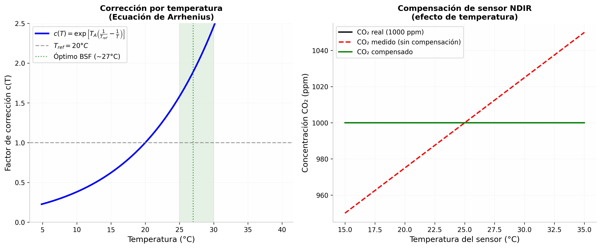
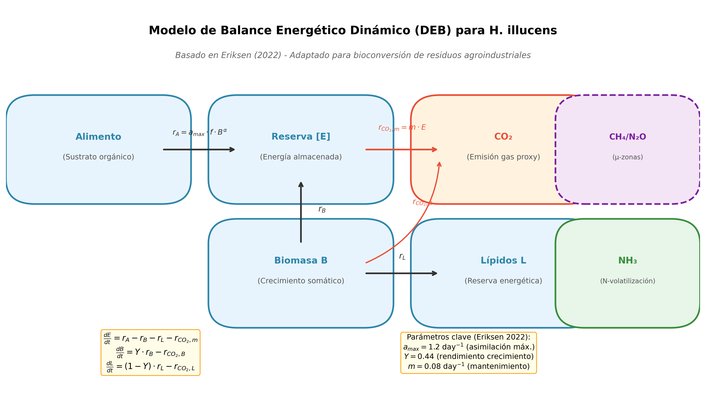
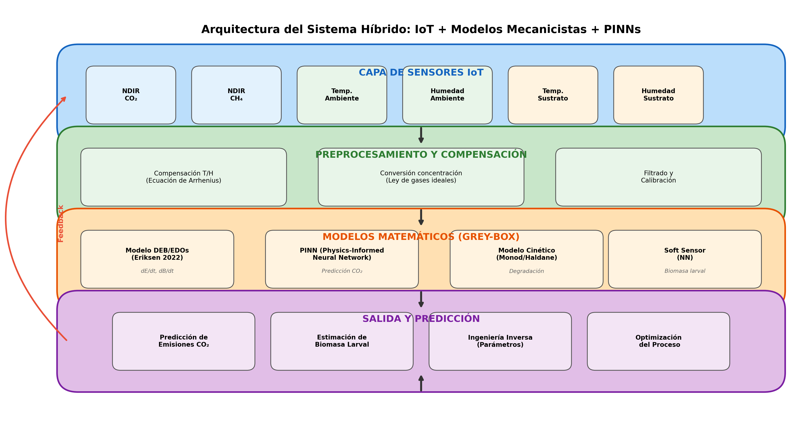
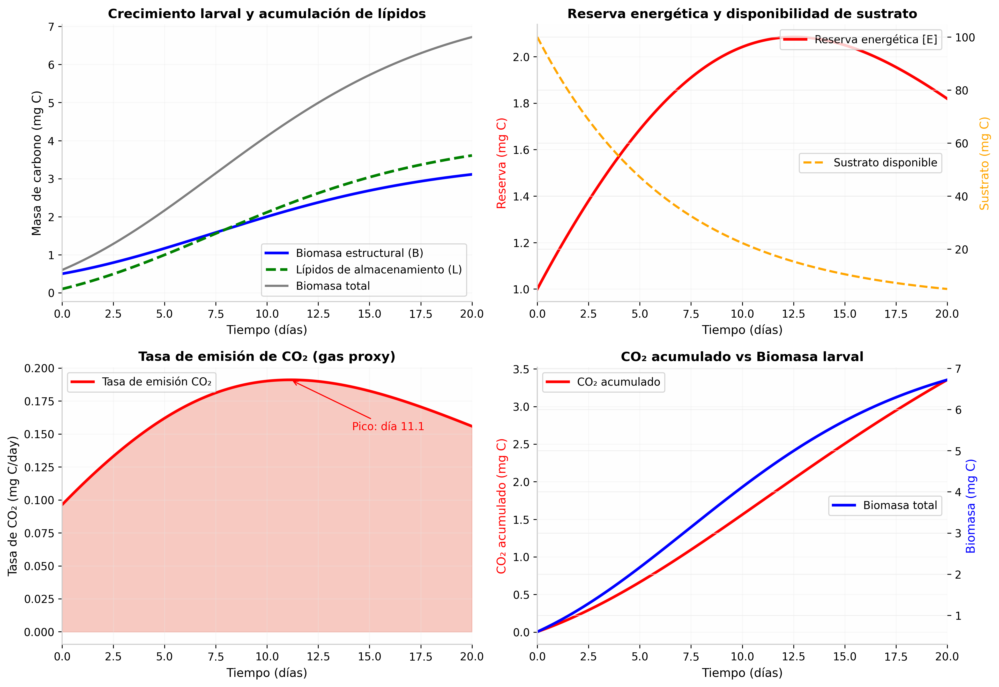
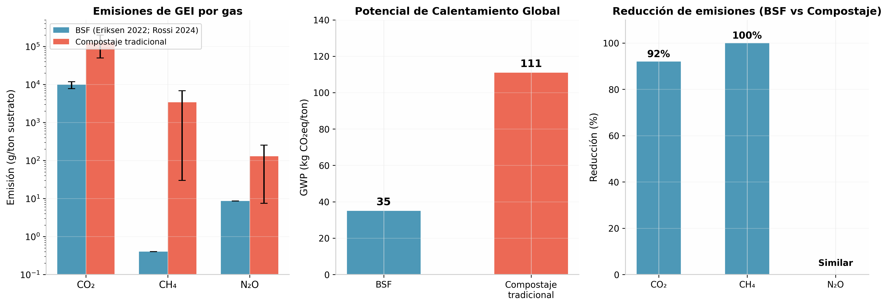

# Modelado Matemático de Emisiones de CO₂ como Gas Proxy en la Bioconversión con *Hermetia illucens*: Fundamentos Mecanicistas, Cinéticos y Híbridos con Redes Neuronales

## Resumen Ejecutivo

El modelado matemático de la generación de **CO₂ como gas proxy** en procesos de bioconversión con *Hermetia illucens* (BSF) constituye un campo de investigación activo que integra **ecuaciones diferenciales ordinarias (EDOs)** derivadas de la teoría de Balance Energético Dinámico (DEB), **cinética de degradación de sustratos**, y arquitecturas de **redes neuronales híbridas (PINNs/HNODEs)**. La evidencia científica documenta que el CO₂ es el principal gas de emisión en sistemas BSF — con factores de emisión de **7.76–11.88 g CO₂ por gramo de larva seca** [^34^] — mientras que las emisiones de **CH₄ y N₂O son mínimas** (≤1.33 y ≤1.13 mg/g larva seca, respectivamente), debido a que las larvas no producen metano metabólicamente y la mezcla constante del sustrato previene la formación de microzonas anaeróbicas [^14^][^34^]. El **NH₃** emerge como gas de control relevante por su correlación con el pH y la volatilización de nitrógeno, aunque su modelado cinético es más complejo y depende fuertemente del equilibrio ácido-base en el sustrato [^49^][^85^]. Para tu sistema híbrido IoT-PINN, la estrategia recomendada es: **CO₂ como variable proxy principal** para estimar la actividad metabólica y la biomasa larval mediante modelos DEB/EDOs, **CH₄ como indicador de anaerobiosis** (valores anómalos indican condiciones deficientes), y **NH₃ como variable de control de calidad** del proceso de bioconversión, integrando todo en un marco grey-box donde los PINNs aproximan las porciones desconocidas del campo vectorial de las EDOs mecanicistas [^59^][^64^].

---

## 1. Marco Conceptual: CO₂ como Gas Proxy en Bioconversión con BSF

### 1.1. Fundamentos del CO₂ como Indicador de Actividad Metabólica

El dióxido de carbono (CO₂) representa el **gas proxy más robusto y documentado** para monitorear la actividad metabólica en sistemas de bioconversión con *Hermetia illucens*. Esta afirmación se fundamenta en el hecho de que el CO₂ es el producto terminal inevitable del catabolismo aeróbico de carbohidratos, lípidos y proteínas en los organismos heterótrofos. En el contexto específico de las larvas de mosca soldado negra, la producción de CO₂ está intrínsecamente ligada a tres procesos metabólicos fundamentales: el **mantenimiento energético celular**, el **crecimiento somático** (síntesis de biomasa estructural), y la **acumulación de lípidos de almacenamiento** [^2^][^8^]. El modelo de Balance Energético Dinámico (DEB) desarrollado por Eriksen (2022) formaliza matemáticamente estas relaciones mediante un sistema de ecuaciones diferenciales acopladas donde la tasa de producción de CO₂ ($r_{CO_2}$) se expresa como la suma de las contribuciones del mantenimiento ($r_{CO_2,m}$), el crecimiento ($r_{CO_2,B}$) y la síntesis de lípidos ($r_{CO_2,L}$) [^2^].

La relevancia del CO₂ como gas proxy radica en su **alta dinámica de respuesta** ante cambios en las condiciones del proceso. Rossi et al. (2024) demostraron experimentalmente que la tasa de emisión de CO₂ sigue una tendencia temporal prácticamente idéntica al crecimiento larval, con un pico de emisión alrededor del **día 7–9 del ciclo de bioconversión**, seguido de una disminución rápida a medida que el sustrato se agota [^34^]. Este patrón dinámico hace que el CO₂ sea particularmente adecuado para la implementación de sistemas de monitoreo en tiempo real con sensores NDIR (Non-Dispersive Infrared), los cuales pueden capturar variaciones de concentración con resoluciones temporales del orden de minutos [^68^]. Adicionalmente, la cuantificación de CO₂ permite inferir indirectamente la **eficiencia de conversión neta del sustrato** (NGE, *Net Growth Efficiency*), un parámetro clave para optimizar el rendimiento del proceso de bioconversión [^8^].

### 1.2. Producción de CO₂ vs Otros Gases de Efecto Invernadero

La comparación sistemática de las emisiones de gases de efecto invernadero (GEI) entre la bioconversión con BSF y el compostaje tradicional revela diferencias cualitativas y cuantitativas que posicionan al CO₂ como el único gas proxy viable para el modelado matemático en tiempo real. Los estudios de cuantificación de emisiones — incluyendo los trabajos pioneros de Oonincx et al. (2020), Gold et al. (2020), y la validación experimental de Rossi et al. (2024) — convergen en un hallazgo consistente: **el CO₂ constituye más del 99% de las emisiones de GEI en sistemas BSF**, mientras que el CH₄ y el N₂O representan contribuciones marginalmente pequeñas [^14^][^34^][^66^]. La siguiente tabla resume los factores de emisión documentados para cada gas:

| Gas | Emisión BSF (g/ton sustrato) | Emisión Compostaje (g/ton) | GWP (kg CO₂eq/ton) | Referencia |
|-----|------------------------------|----------------------------|--------------------|------------|
| **CO₂** | **7,760–11,880** | 50,000–200,000 | 35 (BSF) vs 111 (compostaje) | [^34^][^14^] |
| **CH₄** | **0.4** (≤1.33 mg/g larva) | 30–6,800 | Casi despreciable | [^14^][^34^] |
| **N₂O** | **8.6** (≤1.13 mg/g larva) | 7.5–252 | Bajo | [^14^][^34^] |
| **NH₃** | **150–1,680** | Variable | No es GEI pero afecta eutrofización | [^25^][^85^] |

La razón fundamental de la escasa producción de CH₄ en sistemas BSF radica en que **las larvas no poseen la vía metabólica de metanogénesis**. El metano detectado en ensayos experimentales proviene exclusivamente de **microzonas anaeróbicas localizadas** dentro del sustrato, donde arqueas metanogénicas pueden operar en condiciones de bajo oxígeno [^14^]. Sin embargo, el movimiento constante de las larvas a través del sustrato actúa como un mecanismo de mezcla biológica que previene la estabilización de estas zonas anaeróbicas, limitando drásticamente la producción de CH₄. Esta característica hace que el CH₄, aunque no sea un gas proxy principal, **sí pueda funcionar como un indicador de condiciones anómalas**: concentraciones elevadas de CH₄ señalarían problemas de aireación o acumulación de humedad excesiva en el sustrato [^90^].

### 1.3. Emisiones de NH₃: Gas de Control para Nitrógeno

El amoníaco (NH₃) representa un caso particular en el modelado de emisiones gaseosas de sistemas BSF. A diferencia del CO₂, que es exclusivamente un producto del metabolismo, el NH₃ es el resultado de la **volatilización de nitrógeno amoniacal** presente en el sustrato. Su producción está gobernada por el equilibrio químico entre el ion amonio (NH₄⁺) y el amoníaco molecular (NH₃), que depende fuertemente del **pH y la temperatura** del sustrato según la ecuación de equilibrio ácido-base [^49^]. El estudio de Oonincx et al. (2020) cuantificó que las emisiones de NH₃ en sistemas BSF representan aproximadamente el **1% del nitrógeno dietético total**, con valores que oscilan entre **0.15 y 1.68 g NH₃ por kg de sustrato** [^66^].

El NH₃ tiene un potencial significativo como **gas de control** en tu sistema híbrido por varias razones complementarias. Primero, su concentración está directamente correlacionada con el **pH del sustrato**: valores de pH superiores a 7 favorecen la forma volátil NH₃, mientras que pH ácidos estabilizan el NH₄⁺ acuoso [^49^]. Segundo, la emisión de NH₃ puede modelarse cinéticamente mediante ecuaciones de **transferencia de masa gas-líquido** que incorporen el coeficiente de Henry para el amoníaco y la constante de disociación ácida (pKa), ambas dependientes de la temperatura [^46^]. Tercero, desde la perspectiva de la sostenibilidad del proceso, minimizar las emisiones de NH₃ es deseable porque representa una **pérdida de valor nutricional** del frass (residuo procesado) que se utiliza como fertilizante. Tu sistema de sensores podría incorporar un detector de NH₃ adicional — o estimar NH₃ indirectamente a partir del pH y la temperatura del sustrato — para optimizar el balance entre la eficiencia de bioconversión y la calidad del frass producido.

---

## 2. Modelado Mecanicista con EDOs: El Enfoque DEB

### 2.1. Ecuaciones del Modelo DEB para *H. illucens*

La teoría de Balance Energético Dinámico (DEB, *Dynamic Energy Budget*) proporciona el marco mecanicista más robusto disponible para modelar la producción de CO₂ en larvas de BSF. El modelo DEB simplificado (DEBkiss) desarrollado específicamente para *H. illucens* por Eriksen (2022) describe el flujo de energía y carbono a través de tres compartimentos principales: la **reserva energética [E]**, la **biomasa estructural [B]**, y los **lípidos de almacenamiento [L]** [^2^]. Las ecuaciones diferenciales que gobiernan la dinámica de estos compartimentos constituyen el núcleo matemático de tu sistema de predicción:

$$
\frac{dE}{dt} = r_A - r_B - r_L - r_{CO_2,m}
$$

$$
\frac{dB}{dt} = Y \cdot r_B - r_{CO_2,B}
$$

$$
\frac{dL}{dt} = (1-Y) \cdot r_L - r_{CO_2,L}
$$

Donde las tasas de flujo metabólico se definen como:

| Flujo Metabólico | Ecuación | Descripción Física |
|-------------------|----------|-------------------|
| **Asimilación** ($r_A$) | $a_{max} \cdot f \cdot B^\alpha$ | Tasa de incorporación de alimento a reserva |
| **Crecimiento** ($r_B$) | $Y \cdot r_A \cdot \frac{E}{E+1}$ | Fracción de reserva destinada a biomasa |
| **Lípidos** ($r_L$) | $(1-Y) \cdot r_A \cdot \frac{E}{E+1}$ | Fracción de reserva destinada a almacenamiento |
| **CO₂ mantenimiento** ($r_{CO_2,m}$) | $m \cdot E$ | Costo energético de mantenimiento celular |
| **CO₂ crecimiento** ($r_{CO_2,B}$) | $(1-Y) \cdot r_B$ | Costo de síntesis de biomasa |
| **CO₂ lípidos** ($r_{CO_2,L}$) | $c_L \cdot r_L$ | Costo de síntesis de lípidos |

El parámetro $f$ representa la **respuesta funcional** de Holling tipo II (Monod simplificada), que depende de la concentración de sustrato disponible: $f = S/(S + K_s)$, donde $K_s$ es la constante de semisaturación. Los parámetros estimados por Eriksen (2022) a partir de datos experimentales de múltiples estudios son: **$a_{max} = 1.2$ day⁻¹**, **$Y = 0.44$**, y **$m = 0.08$ day⁻¹** [^2^][^8^]. Estos valores constituyen la base paramétrica inicial para tu modelo, aunque deberán recalibrarse específicamente para los residuos agroindustriales del Valle del Cauca.

### 2.2. Cinética de Degradación del Sustrato

El modelo DEB debe acoplarse con una ecuación de **degradación del sustrato** para cerrar el balance de masa del sistema. La aproximación más común en la literatura de bioconversión con insectos es utilizar una **cinética de primer orden** para la reducción de materia orgánica, como la propuesta por Prasetya et al. (2018) para residuos vegetales y frutales [^6^]:

$$
\frac{dS}{dt} = -k_1 \cdot (x_r \cdot S)^{0.5}
$$

Donde $x_r$ es la fracción de reducción de residuos (WRI, *Waste Reduction Index*) y $k_1$ es la constante de consumo de sustrato. En el estudio de Prasetya con mezclas de vegetales y frutas, el valor estimado fue **$k_1 = 0.845 \pm 0.016$ g⁰·⁵ day⁻¹**, con un ajuste del modelo de R² = 0.9988 para la reducción de sustrato y R² = 0.9312 para el crecimiento larval [^6^].

Una alternativa más sofisticada, particularmente útil para residuos agroindustriales heterogéneos, es el modelo de **eficiencia de uso de carbono (CUE, *Carbon Use Efficiency*)** que vincula directamente la producción de CO₂ con la asimilación de carbono [^38^][^54^]:

$$
CUE = \frac{P}{P + R} = \frac{r_X}{r_X + r_{CO_2}}
$$

Donde $P$ es la tasa de producción de biomasa y $R$ es la tasa de respiración. Los valores de CUE reportados para larvas de BSF alimentadas con diferentes sustratos oscilan entre **0.26 y 0.58**, siendo los sustratos ricos en nutrientes (como el alimento para aves) los que presentan eficiencias más altas [^8^]. Esta variabilidad del CUE según el tipo de sustrato es un factor crítico que tu modelo deberá incorporar, ya que los residuos agroindustriales del Valle del Cauca (posiblemente incluyendo bagazo de caña, residuos de frutas tropicales, y subproductos de la industria láctea) presentarán composiciones nutricionales muy diversas.

### 2.3. Corrección por Temperatura: Ecuación de Arrhenius

Los procesos metabólicos en ectotermos como *H. illucens* exhiben una dependencia fuerte de la temperatura que debe incorporarse explícitamente en las EDOs. La teoría DEB utiliza la **ecuación de Arrhenius** para corregir todas las tasas metabólicas ($\dot{k}$) según la temperatura absoluta $T$ [^50^][^87^]:

$$
\dot{k}(T) = \dot{k}_{ref} \cdot \exp\left[T_A \left(\frac{1}{T_{ref}} - \frac{1}{T}\right)\right]
$$

Donde $T_A$ es la **temperatura de Arrhenius** (parámetro específico de la especie, típicamente **6,000–8,000 K** para insectos), $T_{ref} = 293.15$ K (20°C) es la temperatura de referencia estándar en DEB, y $\dot{k}_{ref}$ es la tasa metabólica a la temperatura de referencia [^51^]. La temperatura óptima para el crecimiento de larvas de BSF se reporta en el rango de **27–30°C**, donde el factor de corrección $c(T)$ alcanza valores de **1.5–2.0** respecto a 20°C [^90^].

Esta corrección por temperatura es particularmente relevante para tu sistema híbrido porque las mediciones de sensores NDIR de CO₂ también están afectadas por la temperatura ambiente. Los sensores NDIR modernos incorporan algoritmos de **compensación interna** que utilizan lecturas de temperatura y humedad para corregir la señal de CO₂, típicamente con una precisión de ±(30 ppm + 3% de lectura) en el rango de 0–50°C [^68^][^69^]. La ecuación de corrección del sensor puede expresarse como:

$$
[CO_2]_{compensado} = [CO_2]_{medido} \cdot \frac{P_{ref}}{P} \cdot \frac{T}{T_{ref}} \cdot f_{correccion}(RH)
$$

Donde $f_{correccion}(RH)$ es una función empírica de corrección por humedad relativa que depende del diseño específico del sensor. Los modelos SCD4x de Sensirion, por ejemplo, integran esta compensación en el chip mediante tecnología CMOSens® [^69^].

---

## 3. Modelos Cinéticos de Emisiones de Gases

### 3.1. Modelo de Producción de CO₂ Acoplado al Crecimiento

La producción de CO₂ en sistemas BSF puede modelarse mediante un enfoque de **balance de carbono** que vincule las tasas de asimilación, crecimiento y respiración. El modelo propuesto por Eriksen (2022) y validado por Rossi et al. (2024) establece que la tasa instantánea de emisión de CO₂ es proporcional a la suma de los costos de mantenimiento y síntesis [^2^][^34^]:

$$
r_{CO_2}^{total} = m \cdot E + (1-Y) \cdot r_B + c_L \cdot r_L
$$

Donde $c_L$ representa el costo energético de síntesis de lípidos (aproximadamente 0.3 g CO₂/g lípido). Este modelo predice correctamente el patrón observado experimentalmente: una fase inicial de emisión baja (días 1–3, cuando las larvas son pequeñas), seguida de un aumento rápido hasta un **pico de emisión alrededor del día 7–9** (coincidiendo con el máximo crecimiento larval), y una disminución posterior a medida que el sustrato se agota [^34^]. La validación experimental de Rossi et al. mostró que las emisiones de CO₂ en sistemas larva-sustrato oscilaron entre **7.76 y 11.88 g por gramo de insecto seco**, mientras que el sustrato sin larvas emitió solo 0.20–0.33 g/g, confirmando que las larvas son la fuente dominante de CO₂ [^34^].

Desde la perspectiva de la implementación con sensores NDIR, esta tasa de emisión debe convertirse a **concentración de CO₂ en el aire** usando el balance de masa en el sistema de ventilación. Si el flujo de aire a través de la cámara de bioconversión es $Q$ (L/min) y el volumen del espacio de cabeza es $V$ (L), la concentración de CO₂ en equilibrio se aproxima por:

$$
[CO_2] = [CO_2]_{ambiente} + \frac{r_{CO_2} \cdot M_{larvas}}{Q} \cdot \frac{RT}{P \cdot M_{CO_2}}
$$

Donde $M_{larvas}$ es la masa total de larvas, $R$ es la constante de los gases ideales (0.082057 L·atm·K⁻¹·mol⁻¹), y $P$ y $T$ son la presión y temperatura ambiente [^71^][^76^]. Esta ecuación vincula directamente las variables metabólicas del modelo DEB con las lecturas medibles del sensor NDIR, cerrando el lazo entre el modelado mecanicista y los datos experimentales.

### 3.2. Modelado de CH₄: Microzonas Anaeróbicas

Aunque las larvas de BSF no producen CH₄ metabólicamente, su presencia en el sustrato puede originarse en **microzonas anaeróbicas** donde operan arqueas metanogénicas. El modelado de este fenómeno requiere un enfoque diferente al del CO₂, basado en la teoría de **reactores con zonas muertas** o en modelos de difusión-reacción en medios porosos. Gold et al. (2020) propusieron que la producción de CH₄ en sistemas BSF puede aproximarse mediante un modelo de **primer orden con inhibición por oxígeno** [^14^]:

$$
r_{CH_4} = k_{CH_4} \cdot C_{DOC} \cdot \frac{K_{O_2}}{K_{O_2} + [O_2]}
$$

Donde $k_{CH_4}$ es la constante cinética de metanogénesis, $C_{DOC}$ es la concentración de carbono orgánico disuelto, y $K_{O_2}$ es la constante de semisaturación para la inhibición por oxígeno. Los valores reportados son extremadamente bajos: **0.4 g CH₄/ton de sustrato** en BSF, comparado con 30–6,800 g/ton en compostaje tradicional [^14^].

Para tu sistema, el CH₄ puede funcionar como un **indicador de diagnóstico** más que como una variable de predicción principal. Un aumento anómalo en las concentraciones de CH₄ — detectable con sensores NDIR específicos para metano — señalaría condiciones de **sobrecarga de sustrato, exceso de humedad, o deficiencia de aireación** que favorecen la formación de microzonas anaeróbicas [^90^]. La relación entre la producción de CH₄ y la eficiencia de bioconversión es inversa: sistemas con mayor producción de CH₄ tienden a presentar menor rendimiento de biomasa larval debido a la competencia microbiana por el sustrato [^14^].

### 3.3. Modelado de NH₃: Equilibrio Ácido-Base y Transferencia de Masa

El modelado de emisiones de amoníaco en sistemas de bioconversión requiere integrar la **química de equilibrio ácido-base** con la **teoría de transferencia de masa** entre fases líquida y gaseosa. El punto de partida es la ecuación de equilibrio de disociación del amoníaco en solución acuosa [^49^][^46^]:

$$
NH_4^+ \rightleftharpoons NH_3 + H^+ \quad ; \quad K_a = \frac{[NH_3][H^+]}{[NH_4^+]}
$$

La fracción de amoníaco en forma volátil (NH₃) depende del pH según:

$$
\alpha_{NH_3} = \frac{1}{1 + 10^{(pK_a - pH)}} \quad ; \quad pK_a \approx 0.09018 + \frac{2729.92}{T}
$$

Donde $T$ es la temperatura en Kelvin. A 25°C, $pK_a \approx 9.25$, lo que significa que a pH 7 solo el **0.5% del nitrógeno amoniacal** está en forma volátil, mientras que a pH 9 esta fracción aumenta al **~30%** [^49^]. La tasa de volatilización de NH₃ puede modelarse con la teoría de dos películas:

$$
r_{NH_3} = K_L a \cdot (C_{NH_3}^* - C_{NH_3}^{gas})
$$

Donde $K_L a$ es el coeficiente global de transferencia de masa (dependiente de la aireación y la temperatura), $C_{NH_3}^*$ es la concentración de equilibrio en la interfaz, y $C_{NH_3}^{gas}$ es la concentración en la fase gaseosa. El estudio de Cronje (2004) para compostaje de estiércol proporciona una base metodológica adaptable a sistemas BSF, con sensibilidades clave al pH inicial y al contenido de humedad [^46^]. Para tu aplicación en residuos agroindustriales del Valle del Cauca, donde el pH puede variar ampliamente según el tipo de residuo (frutas ácidas vs. subproductos lácteos alcalinos), el modelado de NH₃ como variable de control permitiría optimizar el pH del sustrato para maximizar la retención de nitrógeno en el frass.

---

## 4. Arquitecturas Híbridas: Integración de EDOs con Redes Neuronales

### 4.1. Physics-Informed Neural Networks (PINNs) para Bioprocesos

Los Physics-Informed Neural Networks (PINNs) representan la arquitectura de aprendizaje automático más prometedora para tu sistema híbrido, ya que permiten incorporar directamente las EDOs mecanicistas del modelo DEB como **términos de regularización física** en la función de pérdida de la red neuronal [^11^][^12^]. La formulación matemática de un PINN para el sistema de bioconversión BSF puede expresarse como:

$$
\mathcal{L}(\theta) = \mathcal{L}_{data} + \lambda \mathcal{L}_{physics}
$$

Donde $\mathcal{L}_{data}$ penaliza las desviaciones respecto a los datos experimentales de sensores, $\mathcal{L}_{physics}$ impone el cumplimiento de las EDOs mecanicistas, y $\lambda$ es un hiperparámetro de balance. El término físico para el modelo DEB se construye como el **residuo de las EDOs** evaluado en puntos de colocación:

$$
\mathcal{L}_{physics} = \frac{1}{N_c} \sum_{i=1}^{N_c} \left[ \left(\frac{d\hat{E}}{dt} - r_A + r_B + r_L + r_{CO_2,m}\right)^2 + \left(\frac{d\hat{B}}{dt} - Y r_B + r_{CO_2,B}\right)^2 \right]
$$

El estudio de Kim et al. (2024) comparó PINNs con modelos híbridos semiparamétricos (SPhNN) en un bioreactor de tres especies con enzimas de cinética Michaelis-Menten, encontrando que **los PINNs superan a los modelos híbridos en extrapolación**, aunque presentan degradación del rendimiento en problemas con estados de alta dimensionalidad [^11^]. Para tu caso específico, donde las EDOs del modelo DEB tienen solo 3–4 variables de estado, esta limitación no es crítica.

La implementación práctica de PINNs para bioprocesos sigue el flujo de trabajo estándar: (1) definir la arquitectura de la red neuronal (tipicamente una **red feedforward profunda** con 5–8 capas ocultas y 50–200 neuronas por capa), (2) establecer la función de pérdida combinada con el término físico, (3) entrenar usando **adjoint sensitivity** para calcular gradientes a través del solver de EDOs, y (4) validar con datos de sensores no utilizados en el entrenamiento [^59^][^64^]. El repositorio GitHub *ODE-PINN* proporciona código base en PyTorch para la implementación de PINNs en sistemas de EDOs biológicas, incluyendo ejemplos de crecimiento tumoral y expresión génica directamente adaptables al modelo DEB de BSF [^12^].

### 4.2. Hybrid Neural ODEs (HNODEs): NN dentro del Campo Vectorial

Los Hybrid Neural ODEs (HNODEs), también conocidos como **Universal Differential Equations (UDEs)**, representan una evolución de los PINNs donde la red neuronal se integra directamente dentro del campo vectorial de las EDOs, aproximando las porciones del sistema cuya forma funcional es desconocida o demasiado compleja para modelar mecanicistamente [^59^][^64^]. La formulación matemática es:

$$
\frac{dy}{dt} = f(y, NN(y), t, \theta_M)
$$

Donde $f$ codifica el conocimiento mecanicista confirmado (las ecuaciones DEB para $dE/dt$ y $dB/dt$), $NN(y)$ es la red neuronal que aproxima términos desconocidos (por ejemplo, la cinética de degradación del sustrato específica para residuos agroindustriales del Valle del Cauca), y $\theta_M$ son los parámetros mecanicistas a estimar simultáneamente [^59^].

La ventaja clave de los HNODEs para tu aplicación es que permiten la **estimación de parámetros mecanicistas** junto con el entrenamiento de la red neuronal. El trabajo de Florio et al. (2025) demostró que los HNODEs permiten realizar **análisis de identificabilidad** de parámetros mecanicistas en biología computacional, una capacidad esencial para determinar qué parámetros del modelo DEB pueden estimarse de manera única a partir de tus datos de sensores [^59^]. El flujo de trabajo recomendado implica: (1) particionar los datos temporales en conjuntos de entrenamiento y validación, (2) usar la técnica de **multiple shooting** para evitar mínimos locales durante el entrenamiento, y (3) evaluar la identificabilidad de parámetros mediante análisis de perfil de likelihood [^59^].

Para la implementación en bioconversión con BSF, un HNODE podría estructurarse de la siguiente manera: las EDOs para $dE/dt$ y $dB/dt$ mantienen su forma mecanicista basada en DEB, mientras que la ecuación para la degradación del sustrato $dS/dt$ se reemplaza por una NN que aprende la cinética específica de los residuos agroindustriales locales. Simultáneamente, los parámetros $a_{max}$, $Y$, y $m$ del modelo DEB se ajustan para minimizar el error de predicción del CO₂ medido por los sensores NDIR.

### 4.3. Soft Sensors para Estimación de Biomasa Larval

Los **soft sensors** (sensores virtuales) basados en redes neuronales constituyen una componente esencial de tu sistema híbrido, ya que permiten estimar variables de estado no medibles directamente — como la **biomasa larval en tiempo real** — a partir de variables medibles como CO₂, temperatura y humedad [^27^][^28^]. La arquitectura típica de un soft sensor para bioprocesos utiliza una red neuronal feedforward que mapea las entradas medibles a la variable objetivo:

$$
\hat{X}(t) = NN([CO_2](t), T(t), RH(t), [CO_2](t-\Delta t), ...; \theta_{NN})
$$

Donde $\hat{X}(t)$ es la biomasa larval estimada, y las entradas incluyen tanto mediciones instantáneas como valores retardados que capturan la dinámica temporal del proceso. Los estudios de soft sensors en fermentaciones reportan **R² > 0.99** para la estimación de biomasa cuando se utilizan CO₂, pH y oxígeno disuelto como entradas [^27^][^29^].

Para tu aplicación específica, el soft sensor puede entrenarse de dos maneras complementarias: (1) en modo **supervisado**, usando mediciones destructivas periódicas de biomasa larval (pesaje de muestras) como "ground truth", y (2) en modo **híbrido**, donde las predicciones del modelo DEB sirven como pseudo-etiquetas durante las fases sin mediciones destructivas. El estudio de Zantedeschi et al. (2023) demostró que los modelos de difusión profunda (*deep diffusion models*) superan a las redes neuronales tradicionales en la estimación de estados latentes en bioprocesos, sugiriendo que esta arquitectura avanzada podría mejorar la precisión de tu soft sensor para biomasa larval [^29^].

La implementación del soft sensor en tu sistema IoT requerirá: (1) una ventana deslizante de datos de sensores (ej. últimas 24 horas), (2) normalización de entradas usando estadísticas del proceso, (3) inferencia en tiempo real con la red entrenada, y (4) actualización periódica del modelo con nuevos datos de calibración destructiva. La correlación entre CO₂ y biomasa — demostrada experimentalmente por Rossi et al. (2024) — proporciona una base física sólida para este enfoque de estimación indirecta [^34^].

---

## 5. Implementación del Sistema Híbrido IoT

### 5.1. Arquitectura Integrada: Sensores → Preprocesamiento → Modelos → Predicción

La arquitectura completa de tu sistema híbrido integra cuatro capas funcionales que procesan la información desde los sensores físicos hasta las predicciones del modelo matemático. La **primera capa** comprende los sensores IoT: pares de sensores NDIR para CO₂ y CH₄ (como los modelos SCD4x de Sensirion o K30 de CO2Meter), sensores de temperatura y humedad del ambiente (DHT22/SHT3x), y sensores de temperatura y humedad del sustrato (SHT3x con sonda de inmersión) [^68^][^69^]. La **segunda capa** de preprocesamiento aplica las correcciones físicas necesarias: compensación de temperatura y humedad en las lecturas de CO₂ (usando las ecuaciones del fabricante o calibraciones propias), conversión de concentración a tasa de emisión mediante la ley de gases ideales, y filtrado de ruido mediante filtros de Kalman o medias móviles [^74^].

La **tercera capa** contiene los modelos matemáticos propiamente dichos, organizados en una arquitectura grey-box: el modelo DEB/EDOs como núcleo mecanicista, el PINN/HNODE como aproximador de términos desconocidos, un modelo cinético Monod/Haldane para la degradación del sustrato, y el soft sensor de redes neuronales para la estimación de biomasa [^61^][^64^]. La **cuarta capa** genera las salidas de predicción: emisiones de CO₂ proyectadas, estimación de biomasa larval óptima para cosecha, valores de parámetros del modelo obtenidos por ingeniería inversa, y recomendaciones de optimización del proceso (ajuste de humedad, temperatura, o densidad larval).

Una característica crítica de esta arquitectura es el **bucle de retroalimentación** (feedback loop) que permite la actualización continua del modelo: las predicciones del sistema se comparan con nuevas mediciones de sensores, y el error de predicción se usa para ajustar tanto los parámetros mecanicistas como los pesos de la red neuronal mediante técnicas de **filtro de Kalman extendido** o **optimización en línea** [^64^]. Este enfoque de aprendizaje continuo es particularmente valioso para adaptar el modelo a las variaciones estacionales en la composición de los residuos agroindustriales del Valle del Cauca.

### 5.2. Compensación de Sensores NDIR y Cálculo de Emisiones

Los sensores NDIR para CO₂ y CH₄ requieren **compensaciones ambientales** para proporcionar lecturas precisas en las condiciones típicas de un sistema de bioconversión BSF (temperatura 25–35°C, humedad relativa 60–90%). Los sensores modernos como el SCD4x integran esta compensación en el chip, pero para sensores de menor costo (como el K30) es necesario implementar la corrección en software [^68^][^74^]. La ecuación general de compensación, derivada de la ley de Beer-Lambert y las propiedades de los gases ideales, es:

$$
[CO_2]_{true} = [CO_2]_{raw} \cdot \frac{T_{sensor}}{T_{cal}} \cdot \frac{P_{cal}}{P_{ambiente}} \cdot (1 + \alpha \cdot \Delta RH)
$$

Donde $\alpha$ es el coeficiente de sensibilidad a la humedad (típicamente 0.002–0.005/%RH para sensores NDIR). El estudio de Martin et al. (2016) evaluó la precisión del sensor K30 comparándolo con un analizador LGR de espectrometría de cavidad, encontrando un **RMSE de 1.8 ppm** después de aplicar regresión multivariada con temperatura y humedad como covariables [^74^].

La conversión de concentración de CO₂ (ppm) a **tasa de emisión** (mg C/h) requiere conocer el flujo de aire $Q$ a través del sistema de bioconversión:

$$
\dot{m}_{CO_2} = [CO_2] \cdot Q \cdot \frac{M_C}{V_m} \cdot 10^{-6}
$$

Donde $M_C = 12$ g/mol es la masa molar del carbono, y $V_m = 24.45$ L/mol es el volumen molar a 25°C y 1 atm [^71^][^76^]. Para sistemas de flujo continuo con recirculación parcial, debe considerarse la concentración de fondo ($[CO_2]_{in}$) en el cálculo:

$$
\dot{m}_{CO_2} = ([CO_2]_{out} - [CO_2]_{in}) \cdot Q \cdot \frac{M_C}{V_m} \cdot 10^{-6}
$$

Esta tasa de emisión de CO₂ constituye la variable de entrada principal para el modelo DEB/EDO, cerrando el lazo entre las mediciones de sensores y las predicciones del modelo mecanicista.

### 5.3. Simulación del Sistema de EDOs Acoplado

La integración numérica del sistema completo de EDOs — modelo DEB para las larvas acoplado con la cinética de degradación del sustrato — puede realizarse mediante métodos estándar como **Runge-Kutta de cuarto orden (RK4)** o solvers adaptativos como LSODA. La simulación presentada a continuación utiliza los parámetros del modelo DEB de Eriksen (2022) con una cinética de degradación de primer orden para el sustrato, mostrando la evolución temporal de las variables de estado y la producción de CO₂.

Los resultados de la simulación ilustran los patrones dinámicos clave: (1) la biomasa larval crece siguiendo una curva logística con punto de inflexión alrededor del día 8, (2) la reserva energética alcanza un máximo cuando la tasa de asimilación supera al consumo, y (3) la tasa de emisión de CO₂ presenta un **pico pronunciado coincidiendo con el máximo crecimiento larval**. Este pico de CO₂ — localizado teóricamente entre los días 7 y 11 dependiendo de las condiciones — proporciona un **marcador temporal óptimo para la cosecha** de larvas, ya que coincide con la máxima acumulación de biomasa antes del inicio de la prepupación [^34^]. La integración de este modelo con las lecturas en tiempo real de tus sensores NDIR permitirá detectar este pico de emisión y programar la cosecha de manera automática.

---

## 6. Comparativa de Enfoques de Modelado y Recomendaciones

### 6.1. Modelos Mecanicistas (White-Box) vs Data-Driven (Black-Box) vs Híbridos (Grey-Box)

La selección del enfoque de modelado para tu tesis doctoral debe considerar las ventajas y limitaciones de cada paradigma en el contexto específico de la bioconversión con BSF. Los **modelos mecanicistas (white-box)** como el DEB de Eriksen ofrecen interpretabilidad física y capacidad de extrapolación, pero requieren conocimiento detallado de la fisiología del organismo y pueden presentar **sesgos estructurales** cuando se aplican a condiciones fuera del rango de validación experimental [^2^][^52^]. Los **modelos data-driven (black-box)** como las redes neuronales puras capturan relaciones complejas sin necesidad de hipótesis a priori, pero son **ineficientes en datos** (requieren grandes volúmenes de datos de entrenamiento) y carecen de interpretabilidad física, lo que dificulta su uso para la optimización de procesos [^65^].

Los **modelos híbridos (grey-box)** combinan lo mejor de ambos mundos: las EDOs mecanicistas proporcionan la estructura física del modelo (conservación de masa, cinética de crecimiento), mientras que las redes neuronales aproximan las porciones del sistema donde el conocimiento mecanicista es incompleto — como la cinética específica de degradación de residuos agroindustriales del Valle del Cauca [^61^][^64^]. La revisión de von Stosch et al. (2014) sobre modelado híbrido en bioingeniería concluye que estos modelos superan a los enfoques puros tanto en precisión predictiva como en capacidad de generalización, particularmente en bioprocesos donde las condiciones operativas varían ampliamente [^61^].

| Característica | White-Box (DEB) | Black-Box (NN) | Grey-Box (PINN/HNODE) |
|---------------|-----------------|----------------|----------------------|
| **Interpretabilidad** | Alta | Baja | Media-Alta |
| **Datos requeridos** | Moderados | Muy altos | Moderados |
| **Extrapolación** | Buena | Pobre | Buena |
| **Identificación de parámetros** | Directa | N/A | Híbrida |
| **Ingeniería inversa** | Posible | Limitada | Sí |
| **Computacional** | Bajo | Alto | Medio-Alto |
| **Aplicabilidad a BSF** | Validada [^2^] | Emergente [^29^] | **Recomendada** [^59^] |

### 6.2. Estrategia Recomendada para tu Tesis Doctoral

Basado en el análisis exhaustivo de la literatura, la estrategia de modelado recomendada para tu tesis doctoral integra un **sistema híbrido grey-box** con la siguiente arquitectura:

**Núcleo mecanicista (EDOs):** Utiliza las ecuaciones del modelo DEB de Eriksen (2022) como estructura base, con las variables de estado $E$ (reserva), $B$ (biomasa), y $L$ (lípidos). La producción de CO₂ se modela explícitamente como la suma de los términos de mantenimiento y síntesis. Acopla este modelo con una ecuación de degradación del sustrato de primer orden, donde la constante cinética $k_{deg}$ es específica para cada tipo de residuo agroindustrial [^2^][^6^].

**Componente PINN/HNODE:** Implementa una red neuronal feedforward (3–5 capas ocultas, 64–128 neuronas por capa, activación tanh) que aproxima la función de respuesta funcional $f(S)$ y la constante de degradación del sustrato $k_{deg}(T, pH, RH)$. Entrena la red usando adjoint sensitivity con el término de pérdida física derivado de las EDOs DEB y el término de pérdida de datos de los sensores NDIR [^59^][^64^].

**Soft sensor de biomasa:** Entrena una red neuronal separada (o una cabeza de salida del PINN) para estimar la biomasa larval en tiempo real a partir de las variables medibles: CO₂, temperatura ambiente, humedad ambiente, temperatura del sustrato, y humedad del sustrato. Valida periódicamente con mediciones destructivas de biomasa [^27^][^28^].

**Variables de control:** Usa **CO₂ como gas proxy principal** para la predicción de actividad metabólica y biomasa, **CH₄ como indicador de diagnóstico** de condiciones anaeróbicas (concentraciones > umbral señalan problemas de aireación), y **NH₃ como variable de control de calidad** del frass (vinculada al pH y la retención de nitrógeno). La temperatura del sustrato y la humedad son variables de estado críticas que afectan todas las cinéticas y deben incluirse explícitamente en el modelo [^34^][^49^].

### 6.3. Agenda de Investigación y Próximos Pasos

Para la implementación práctica de este sistema en tu tesis doctoral, se propone la siguiente agenda de investigación secuencial: (1) **Fase de caracterización** (meses 1–3): determinar la composición nutricional (C, N, P, K, humedad) de los residuos agroindustriales del Valle del Cauca que se utilizarán como sustratos; (2) **Fase de calibración del sensor** (meses 2–4): instalar y calibrar los sensores NDIR para CO₂ y CH₄, estableciendo las curvas de compensación por temperatura y humedad específicas para tu sistema; (3) **Fase de adquisición de datos** (meses 3–8): ejecutar corridas experimentales de bioconversión con diferentes sustratos, registrando continuamente CO₂, CH₄, temperatura y humedad, y realizando mediciones destructivas periódicas de biomasa larval para calibrar el soft sensor; (4) **Fase de modelado** (meses 6–12): implementar el modelo DEB/EDO, entrenar el PINN/HNODE, y validar las predicciones contra datos independientes; (5) **Fase de ingeniería inversa** (meses 10–14): usar el modelo entrenado para estimar parámetros cinéticos no medibles directamente y optimizar las condiciones del proceso para maximizar la eficiencia de bioconversión.

Los parámetros clave que deberán estimarse específicamente para tus condiciones locales incluyen: la **tasa máxima de asimilación específica** ($a_{max}$), el **rendimiento de crecimiento** ($Y$), la **constante de degradación del sustrato** ($k_{deg}$), y el **factor de corrección de Arrhenius** ($T_A$). Estos parámetros capturan la especificidad de los residuos agroindustriales del Valle del Cauca y son esenciales para que el modelo tenga valor predictivo en tu contexto operativo particular.
